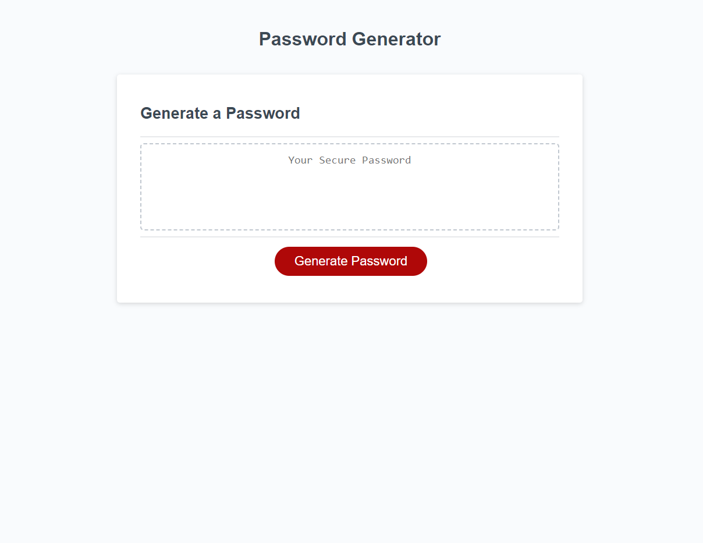

# Password Generator

This is a website for creating a pseudorandomized character string from 8-128 characters long.

## URL

Coming Soon

## Usage

Users will press a button then face a series of prompts asking for the length of the password desired, what characters to use with the ability to choose from numbers, upper case letters, lower case letters, and symbols.  Note that failing to choose any character options as well as choosing a password length of less than 8 or more than 128 characters will result in an error message and reload the page.

# Screenshot

## Contributing
Pull requests are welcome. For major changes, please open an issue first to discuss what you would like to change.

Please make sure to update tests as appropriate.

## By Joshua Cooley

## License
[MIT](https://choosealicense.com/licenses/mit/)
